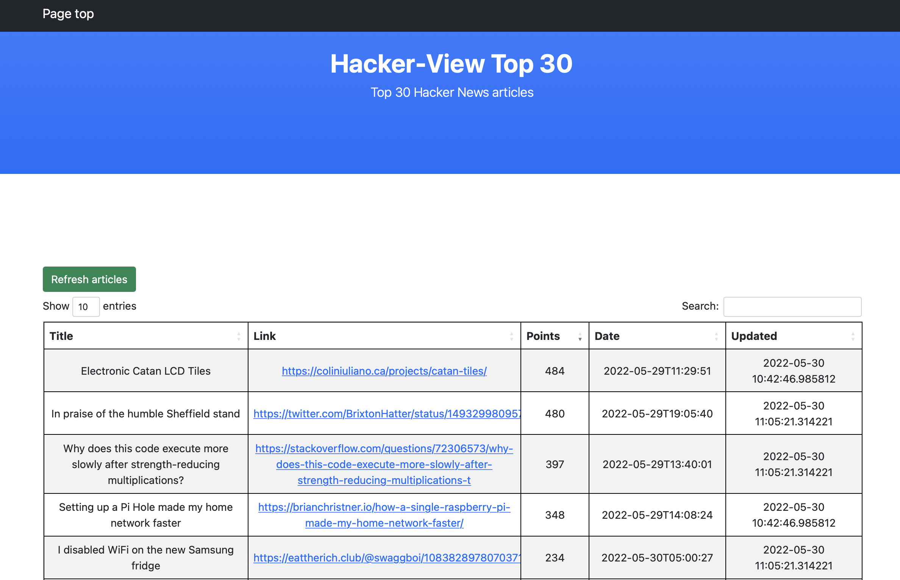

# Hacker-view

Hacker-view (HW) is a Flask based project that scraps the latest top-30 articles 
and lists them in a searchable datatable.

HW stores the data in SQLite database as it is lightweight, small and current project scope does not
require more advanced database type.

This application is dockerized as well as could be installed independently.

## Installation and usage

### Docker way (docker must be installed locally)

1. Clone the repository

2. Build the image
    
        docker build --tag hacker-view . 

3. Create and run the container 
        
        docker run -p 5000:5000 hacker-view

4. Navigate to `http://127.0.0.1:5000` or `http://localhost:5005`

### Local installation

1. Clone the repository and create a virtual environment for it.
   Currently, HW uses Python 3.10

       python3.10 -m venv venv
       source venv/bin/activate

2. Install the requirements
   
      `pip install -r requirements-dev.txt`

3. Launch the application with `python -m application` from the application's root folder

4. Navigate to `http://127.0.0.1:5000` or `http://localhost:5005`

## Database
      
SQLite database `hacker-view.db` is provided in the repository

## Testing

1. Launch the tests with `pytest tests`

